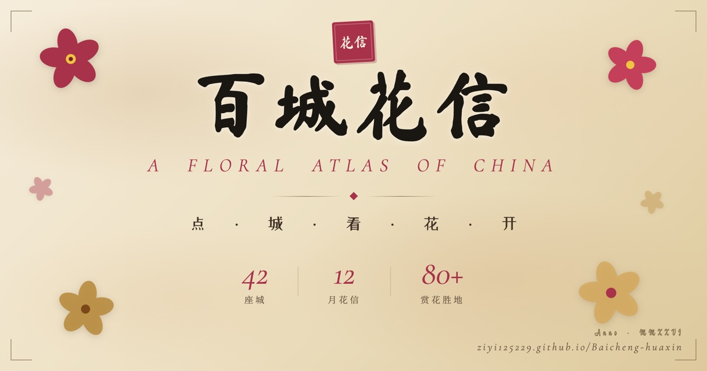

# 百城花信 · 中国市花地图

> 点 · 城 · 看 · 花 · 开

一张可交互的中国城市花卉地图。**42 座城市市花** × **12 个月花信流转** × **80+ 处经典赏花胜地**,配古典水彩花卉图鉴、花语诗词与花期日历。

🌸 **在线访问：https://ziyi125229.github.io/Baicheng-huaxin/**



---

## 特性

- 🗺️ **42 座城市 × 22 种市花** —— 含拼音、所属省份、评定年份、花语诗词
- 📅 **12 月花信流转** —— 月份切换,城市花朵按地理顺序"花信由南向北/由北向南"依次开放,带季节配色与水墨晕染纹理
- 🌺 **80+ 处赏花胜地** —— 武大樱园、香雪海、洛阳牡丹园、阳明山樱花…每个含地址、交通、门票、花期、最佳观赏时间、意境画 + 实景照片切换
- 🎨 **水彩花卉图鉴** —— 22 种花全手绘 canvas 水彩(梅、牡丹、月季、玫瑰、荷、菊、玉兰、桂、茶花、木棉、三角梅、丁香、茉莉、杜鹃、石榴、君子兰、朱槿、芙蓉、紫荆、兰花、格桑、马兰)
- 🍃 **季节飘落动画** —— 春落花瓣、秋落红叶/银杏、冬落雪 + 偶有梅花
- 📍 **IP 定位** —— 一键找到你所在城市
- 🔍 **搜索 + 筛选** —— 按城市名、花种、拼音、拉丁名搜索;按花种过滤地图
- ✒️ **诗笺生成** —— 任意城市花朵可导出为 750×1280 竖版分享图(适合微信/小红书)
- 📷 **真实照片** —— 默认水彩画,一键切换 iNaturalist + 维基百科真照片
- 🛠️ **自定义图片** —— ✏️ 上传自己拍的照片 + 📋 导出代码,可永久嵌入 HTML 让所有人都看到
- 📱 **PWA** —— 可添加到手机主屏当 App 用,离线可访问
- 🎯 **完整 SEO** —— Open Graph + Twitter Card,分享到微信/微博显示精美卡片

## 技术栈

**零依赖单文件 HTML**(index.html,约 465 KB,~11500 行)。所有 SVG 地图路径、城市坐标、花卉数据、水彩 canvas 绘制函数都在一个文件里。

- 地图: 内嵌 SVG path(中国行政区划)
- 花卉绘制: 纯 HTML5 Canvas + 自研水彩算法(分层晕染 + 高光叠加 + 莫兰迪色相滤镜)
- 数据: 城市花卉、花期、诗词、赏花点全部硬编码 JS 对象
- 字体: Noto Serif SC / Ma Shan Zheng / ZCOOL XiaoWei / Cormorant Garamond(Google Fonts)
- 真实照片: iNaturalist API + Wikimedia API(无需 token)

## 文件清单

```
index.html              主页面(单文件应用)
og-image.jpg            分享预览图(1200×630)
icon-192.png            PWA 图标
icon-512.png            PWA 图标
apple-touch-icon.png    iOS 主屏图标
manifest.json           PWA 配置
sw.js                   Service Worker(离线缓存)
README.md               本文件
```

## 本地预览

直接双击 `index.html`,或:

```bash
git clone https://github.com/ziyi125229/Baicheng-huaxin.git
cd Baicheng-huaxin
python3 -m http.server 8000
# 浏览器打开 http://localhost:8000
```

> 部分功能(自定义图片导出、Service Worker)需要在 HTTP 服务器下访问,不能直接 `file://`。

## 数据致谢

- 城市市花评定: 多来自 1980 年代各市人大决议
- 花语、诗词: 古典诗词及现代咏物诗
- 真实照片: [iNaturalist](https://www.inaturalist.org/)(CC 协议) + [Wikimedia Commons](https://commons.wikimedia.org/)(CC 协议)
- 字体: Google Fonts(SIL Open Font License)

## License

代码 MIT;水彩绘制算法、城市花卉数据为作者原创。
